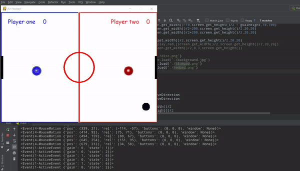

<!-- Reda Ghanem -->

# Air-hockey

Simple pygame implementation of 2 player Air Hockey game 2019  
Score updation and basic features. 
<b>Softwares</b> : python 2.x or 3.x must be installed for playing. Keep all the files in same folder for proper functioning.

<b>Controls</b> : Player 1 - W,A,S,D  
                     Player 2 - arrow keys

<b>Instructions</b> : Player controls tha mallets , disc as soon as hits either goal , score is accounted and disc is reset at center  

<b>Test:</b> 

